# 🧠 RTMS LLM Router with ChromaDB Tools (MCP Architecture)

This repo contains **three distinct typescript projects**, each representing a component in an **MCP (Model Context Protocol)** based system for tool-augmented LLM interaction.

---

## 🧱 Overview

| Project | Description |
|--------|-------------|
| `llm-router-server` | Central router server that receives LLM requests, calls Anthropic’s Claude model, and routes tool calls if needed. |
| `tools-chroma-server` | Exposes ChromaDB-based semantic storage/querying tools via MCP. This project assumes you already setup your own chromaDB + data on docker (port 8000) |
| `tools-zoom-openapi-server` | Expose 4 hardcoded sample interfaces to demonstrate API calls made to external system. in this case Zoom Open API |
| `mcp-client` | Zoom RTMS transcript sends requests to `llm-router-server`'s `ask-llm` and interprets responses. This serves as the entry point |

---

## 🗂 Project Breakdown

### 1. `llm-router-server`

🔁 **LLM Router & Orchestrator**

- Hosts an MCP server (`ask-llm`) that:
  - Accepts user queries.
  - Sends them to **Claude** via the [Anthropic API].
  - Allows Claude to **invoke external tools** (like `chroma-database-query` and `chroma-database-add`) as needed.
  - If the query tool is used, performs a **RAG-like flow** (i.e. calls Claude again with results).
- Connects to external tools via manifest (`/.well-known/mcp.json`) using HTTP POST (`/mcp`).
- Supports tool chaining logic, conditional execution, and fallback responses.

➡️ Acts as the **core brain and controller**.

---

### 2. `tool-chroma-server`

📚 **ChromaDB-backed Tool Server**

- Hosts tools via MCP to:
  - `chroma-database-add`: Store documents into ChromaDB.
  - `chroma-database-query`: Perform semantic searches using natural language.
- Uses `chromadb` and `@chroma-core/default-embed` to generate embeddings and run queries.
- Exposes a standard MCP manifest endpoint.

➡️ Acts as the **tool backend** (semantic memory system).

---

### 3. `mcp-client`

🧪 **Client/Consumer App**

- Sends queries to the `llm-router-server` via  `Client` and `StreamableHTTPClientTransport` provided by `'@modelcontextprotocol/sdk/...`
- Can be used by:
  - Web frontends
  - Bots
  - CLI tools
- Receives either Claude’s answer or tool output routed via the MCP chain.

➡️ Acts as the **entry point** for users or client apps.

---

## 🧠 High-Level Flow

```mermaid
sequenceDiagram
    actor User
    participant LLM Router
    participant Claude
    participant ChromaDB Tool Server

    User->>LLM Router: "What is Meeting SDK?"
    LLM Router->>Claude: Prompt + tool manifest
    Claude->>LLM Router: Tool use → chroma-database-query
    LLM Router->>ChromaDB Tool Server: { query: "Meeting SDK" }
    ChromaDB Tool Server->>LLM Router: Matching docs
    LLM Router->>Claude: Second call with retrieved context
    Claude->>LLM Router: Final answer
    LLM Router->>User: Full LLM answer with tool result
```



---

## 🚀 How to Run (Quickstart)

```bash
# Start ChromaDB locally (you must install chromadb separately)
docker run -p 8000:8000 ghcr.io/chroma-core/chroma

# Start Chroma tool server (start this first)
cd chroma-mcp-server
npm start

# Start LLM Router (start this second)
cd llm-router-server
npm start

# Start client (start this last)
cd mcp-client
npm start
```
---

Why is there a sequence of which service to start first? The server object need to be initiatlized, before the client can successfully establish a transport connection

## 📦 MCP Tool Schema

Every tool implements:

```json
{
  "type": "server.tool",
  "name": "chroma-database-tools",
  "version": "1.0.0",
  "description": "Tools for searching and storing documents in ChromaDB (chroma database).",
  "tools": [
    {
      "name": "chroma-database-add",
      "description": "Store a document in ChromaDB (chroma database) for future semantic search.",
      "input_schema": {
        "type": "object",
        "properties": {
          "id": { "type": "string" },
          "text": { "type": "string" }
        },
        "required": ["id", "text"]
      }
    },
    {
      "name": "chroma-database-query",
      "description": "Use this tool to search relevant documents in ChromaDB (chroma database) by keyword or question. Always use this for factual or technical answers.",
      "input_schema": {
        "type": "object",
        "properties": {
          "query": { "type": "string" },
          "n": { "type": "number" }
        },
        "required": ["query"]
      }
    }
  ]
}

```

---

## 🔗 Related Concepts

- **Model Context Protocol (MCP)** – A lightweight RPC format for LLM routing and tool execution.
- **Claude by Anthropic** – The foundation model used for reasoning and tool selection.
- **ChromaDB** – A vector database for storing and querying documents with embeddings.
- **RAG (Retrieval-Augmented Generation)** – A method of enhancing LLM responses with external context.

---

